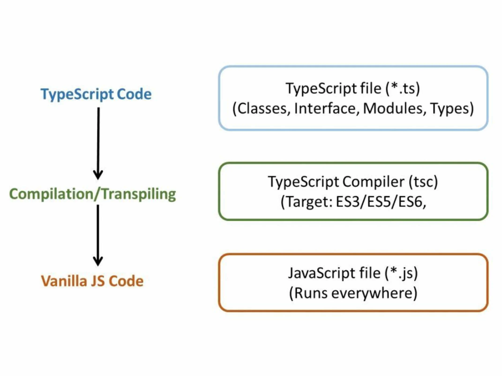

# Curso de Fundamentos de TypeScript
By Nicolas Monila

## 1. Por qué usar TypeScript

Según un estudio, TypeScript puede prevenir hasta un 15% de fallas en tus proyectos. TypeScript va a estar analizando tu código constantemente indicando posibles fallas o mejores maneras de escribir tu código.
Percepción

    Según Octoverse 2021, una encuesta que realiza GitHub a sus desarrolladores en la que mide la percepción de ciertos lenguajes, TypeScript ha tenido una acogida creciente desde el 2017 hasta el 2021
    Percepción de TypeScript: 2017 - 2021
    NPM Trends nos dice, basado en la descarga de paquetes, que TypeScript está siendo usado por muchas librerías y proyectos en todo el ecosistema JavaScript
    Uso de TypeScript: 2016 - 2022
    TypeScript en la encuesta de Stack Overflow de 2020 quedó como el segundo lenguaje más amado por los desarrolladores
    Lista de lenguajes más amados del 2020

Testimonios

    Según VueJS, puede evitar varios errores que podrían ir a producción
    ReactJS nos dice que puede prevenir muchos problemas antes de correr el código
    Slack indica que tiene una gran integración con el editor, incrementando la productividad de los desarrolladores
    Airbnb comenta que le ayudó a prevenir hasta un 38% de bugs y que los ingenieros pueden avanzar más rápido y seguro

Para este curso se requerirá tener instalado:

    NodeJS
    Un navegador web. Se recomienda Google Chrome
    Un editor de código. Se recomienda Visual Studio Code

Analizar codigo estatico, Vue.js, GitHub, Nest, 
slack, airbnb, 

Bandwagon effect
typeScript analizara mi codigo constantemente.

## TypeScript vs. JavaScript

¿TypeScript es diferente a JavaScript? ¿Un desarrollador en TypeScript es diferente a uno en JavaScript? La respuesta a ambas es sí, sin embargo, no hay una notable diferencia. Uno (TypeScript) se base en el otro (JavaScript) añadiendo elementos para mejorar la detección de bugs y experiencia de desarrollo.
Panorama

JavaScript ha sufrido un incremento exponencial en su uso, pues se puede usar en Frontend, Backend, IoT, entre otros. No obstante, este no fue creado como un lenguaje maduro desde el inicio, fue con el tiempo que ha ido mejorando hasta lo que es hoy en día.

En JavaScript solo te das cuenta de que tienes un error hasta el momento en que lo ejecutas, sea en el navegador o en un entorno de ejecución como NodeJS, más no antes. Lo que queremos como desarrolladores es obtener retroalimentación lo antes posible para tener la menor cantidad de errores en producción

TypeScript{ESNect{JS}}
¿Qué significa análisis de código estático?

    Entre más rápido encuentres un error, más fácil será solucionarlo

En el libro Software Engineering at Google[1] señalan ciertas capas para detectar fallas en el desarrollo de programas:

    Análisis de código estático: corre en el editor de código en busca de un typo (error en la escritura de un término), llamadas incorrectas a funciones y brinda autocompletado de código
    Pruebas Unitarias (Unit Tests): se realiza pruebas para verificar si una parte del código hace lo que queremos que ejecute
    Pruebas de Integración (Integration Tests): vemos como todo el código funciona en conjunto y que se ejecute cómo deseamos
    Revisión de código (Code Review): se verifica si se ha seguido con las normas, estándares y mejores prácticas establecidas por el equipo

[1] Sofware Engineering at Google. Lessons Learned from Programming Over Time - Titus Winters, Tom Manshreck y Hyrum Wright.

Analisis de codigo estatico

"the earlier  you find a mistake the easier it fo fix"

## Configurado nuestro proyecto

No vamos a instalar TypeScript de manera global, sino solo para el proyecto, ya que normalmente así se hace en mundo real. Se trabaja por proyecto.

Realicemos los siguientes pasos:

    Creamos una carpeta para nuestro proyecto (el nombre que desees) e ingresamos a la misma. Mediante la terminal sería lo siguiente:
```
mkdir ts-project
cd tsc --version
```
    Abrimos nuestro editor de código desde la ubicación de la carpeta del proyecto. Si usas Visual Studio Code, usando la terminal es así:
```
code .
```
    Crearemos los siguientes archivos:

    Un archivo .gitignore en el editor o desde la terminal. Para su contenido, podemos utilizar la página gitignore.io. En nuestro programa necesitaremos las siguientes especificaciones:
    Página de gitignore

Luego copiamos lo que nos genera la web y lo pegamos en nuestro gitignore desde nuestro editor de código.

    Un archivo .editorconfig (opcional), si estás usando Visual Studio Code, con el fin de dar una configuración simple y sencilla a la hora de ejecutar código. Aquí copia y pega lo siguiente:

# Editor configuration, see https://editorconfig.org
```
root = true
[*]
charset = utf-8
indent_style = space
indent_size = 2
insert_final_newline = true
trim_trailing_whitespace = true

[*.ts]
quote_type = single

[*.md]
max_line_length = off
trim_trailing_whitespace = false
```
Para que funcione esta configuración debes tener instalado la siguiente extensión en tu Visual Studio Code:


    Necistaremos también tener creado una carpeta de nombre src dentro de nuestro proyecto
    Ahora crearemos nuestro archivo package.json de manera simple desde la terminal y dentro de la ruta del proyecto:
```
npm init -y
```
Así debería estar quedando conformado nuestro proyecto previo al último paso
Archivos de configuración

    Finalmente, instalemos TypeScript 😊. Desde la terminal y dentro de la ruta del proyecto, ejecuta:

```
npm install typescript --save-dev
```

Para verificar la versión instalada:
```
npx tsc --version
```

## Atrapando bugs

El análisis de código estático nos ayudará a detectar fallas en nuestro programa durante su desarrollo.

En la carpeta src del proyecto de curso, vamos a crear un archivo JavaScript llamado demo.js. El código base es el siguiente:

```
(()=> {
  const myCart = [];
  const products = [];
  const limit = 2;

  async function getProducts() {
    const rta = await fetch('http://api.escuelajs.co/api/v1/products', {
      mehtod: 'GET'
    });
    const data = await rta.parseJson();
    products.concat(data);
  }
  function getTotal() {
    const total = 0;
    for (const i = 0; i < products.length(); i++) {
      total += products[i].prize;
    }
    return total;
  }
  function addProduct(index) {
    if (getTotal <= limit) {
      myCart.push(products[index]);
    }
  }

  await getProducts();
  addProducto(1);
  addProducto(2);
  const total = getTotal();
  console.log(total);
  const person = {
    name: 'Nicolas',
    lastName: 'Molina'
  }
  const rta = person +  limit;
  console.log(rta);
});
```

Al analizarlo nos damos cuenta de que tiene unos errores que podrían pasar desapercibidos al no ver advertencias. Es hasta que lo ejecutamos en un navegador web o entornos como NodeJS que los bugs saldrán a relucir. Por lo que, nosotros como desarrolladores, esto no es conveniente, pues queremos feedback lo más pronto posible.
Activando poderes de TypeScript en JavaScript 🧐

Si estás en Visual Studio Code, puedes activar el analizador de código estático de TypeScript sobre un archivo JavaScript. Para esto, en la primera línea del archivo debe ir lo siguiente:

//@ts-check

## El compilador de TypeScript

Este compilador lo que realmente hace es transpilar, pues ni el navegador ni Node.js (a abril de 2022) pueden leer nativamente archivos TypeScript, por lo que realiza un proceso de traducción en la que su código lo convierte a JavaScript.




Fases del compilador de TypeScript
Compilación de archivos TypeScript desde Node.js


Para realizar el proceso de transpilación en Node.js, ejecutemos lo siguiente en la terminal:

npx tsc archivo_typescript.ts

Tras esto, se creará un archivo JavaScript dentro de la misma carpeta donde este tu archivo TypeScript y con el mismo nombre. Por ejemplo, en nuestro proyecto realizamos esa operación dentro de la carpeta src con el archivo 01-hello.ts, dando como resultado:
Resultado del comando: npx tsc archivo_typescript.ts
Compilación a una versión específica

Podemos hacer que nuestro archivo TypesSript sea transpilado a un archivo JavaScript, por ejemplo, con el estándar ECMAScript 6. Para ello ejecutemos:

npx tsc archivo_typescript.ts --target es6

Enviando compilación a una carpeta

Si deseas que los archivos transpilados no se generen en la misma carpeta donde están tus archivos TypeScript, puedes indicarle al compilador hacia donde quieres que vayan:

npx tsc archivo_typescript.ts --target es6 --outDir carpeta_destino

También podrías indicar que deseas aplicar la anterior operación a todos los archivos con extensión TypeScript:

npx tsc *.ts --target es6 --outDir carpeta_destino

Deno: un entorno nativo para ambos lenguajes

Deno, del mismo creador de Node.js, es un nuevo entorno de ejecución para JavaScript que puede correr también nativamente TypeScript. Sin embargo, aún no tiene la madurez en el ecosistema de Node.js

```
   2        8.945 npx tsc .\src\01-hello.ts
   3        6.628 npx tsc .\src\demo.js.old
   4       12.043 npx tsc .\src\demo.ts
   5        7.695 npx tsc .\src\demo.ts --target es6
   6        8.332 npx tsc .\src\demo.ts --target es6 --outDir dist
   7        7.832 npx tsc .\src\*.ts --target es6 --outDir dist
   8       11.577 npx tsc .\src\01-hello.js --target es6 --outDir dist
  10        5.995 npx tsc .\src\01-hello.ts --target es6 --outDir dist
```

Deno ya no tranpila a js si no corre nativamente TS

## Veamos el TSConfig.json

Nos ayuda a ahorrar mucho trabajo manual como transpilar archivo por archivo, indicar el target, etc.
Creando un archivo TSConfig.json

En la terminal, ubicándonos dentro del directorio en el que queremos que se cree el archivo, ejecutemos:

npx tsc --init

Nos creará automáticamente el archivo con propiedades básicas activadas:
Resultado al correr el comando: npx tsc --init

Dentro del archivo TSConfig.json podemos ver que tiene muchas propiedades comentadas (desactivadas) y de las cuales solo algunas están activadas.
Compilación en TypeScript

Nuestro código TypeScript se transpilará según las propiedades indicadas en nuestro archivo `TSConfig.json``:

npx tsc

Compilación en tiempo real

Nos puede resultar tedioso estar ejecutando el comando anterior siempre después de escribir nuestro código. Para evitar esto, podemos hacer que el compilador esté detectando cada cambio que realicemos en nuestros archivos TypeScript y haga la transpilación de inmediato:

npx tsc --watch

Proyecto

    Creemos el archivo TSConfig.json en nuestro proyecto
    Activamos las siguientes propiedades dentro de dicho archivo:

    outDir: indicando la carpeta dist como el directorio destino de los archivos transpilados
    Ejemplo de outDir

    rootDir: indicamos que nuestros archivos TypeScript, los cuales serán “compilados” luego, estarán en la carpeta src
    Ejemplo de rootDir

    Creamos el archivo 02-demo2.ts dentro de la carpeta src con el siguiente código:

const numbers = [1,3,4];

    Probemos la compilación de nuestros archivos:

npx tsc

Estructura de archivos del proyecto de TypeScript

Observaremos que los archivos transpilados se encuentran en nuestra carpeta dist.

con errores y todo TS de lo transpila.


npx tsc --watch

## Tipos inferidos

TypeScript puede inferir el tipo de dato de una variable a pesar de no haberlo declarado explícitamente.
Inferencia de tipos

A partir de la inicialización de la variable TypeScript infiere el tipo que será a lo largo del código y este no puede variar. Por ejemplo:

let myName = "Victoria";

Si bien no indicamos el tipo de dato como se haría de esta manera:

let myName: string = "Victoria";

TypeScript infiere que la variable myName será del tipo string y en adelante no podrá tomar un valor que no sea de este tipo de dato.

myName = 30; 
//Nos señalará como error pues se le quiere asignar un número a una variable de tipo string.

En Visual Studio Code puedes obtener autocompletado teniendo sugerencias según el tipo de dato que sea la variable:
Autocompletado en Visual Studio Code
Nombres de variables iguales

TypeScript te indicará como error aquellas variables con el mismo nombre a pesar de estar en archivos distintos. Esto no sucederá en entornos preconfigurados como por ejemplo Angular o React, ya que estos trabajan de forma modular o tienen un alcance (scope) para cada variable.

Si deseas trabajar con los mismos nombres de variables en diferentes archivos, puedes crear una función anónima autoejecutada:

( () => {
    let myName = "Victoria";
})();

Lo mismo por cada variable que desees tener el mismo nombre (myName para este ejemplo) deberás crear este tipo de función para evitar que te den estas advertencias.

## Booleans

Este tipo de dato puede tomar dos valores: true o false.
```
let isEnable: boolean = true;
let isNew = false;
```

## Strings
Este tipo de dato nos permite almacenar una cadena de caracteres.

Podemos definir un string con:

    Comillas simples:

let myProduct = 'Soda'; //CORRECTO
let comillasDobles = 'Puedo "usar" comillas dobles tambien'; //CORRECTO
let comillaInvalida = 'No puedo 'usar' otra vez una comilla simple'; //INCORRECTO

Se pueden usar comillas dobles dentro, más no otra vez comillas simples.

    Comillas dobles:

let myProduct = "Soda"; //CORRECTO
let comillaSimple = "Puedo 'usar' comilla simple tambien"; //CORRECTO
let comillaInvalida = "No puedo "usar" otra vez las comillas dobles"; //INCORRECTO

Se puede usar comillas simples dentro, más no otra vez comillas dobles.

    Usando backticks:

let myName = `Frank`;

Esta forma de asignar string trae algunas ventajas:

    Declarar valores de múltiples líneas:

let texto = `
    Nunca
    pares
    de aprender :)
`;

    Concatenar dentro del mismo string. Para esto es necesario usar este símbolo del dólar seguido de llaves ${} y escribir lo que queremos concatenar dentro de esas llaves:

let variableTitulo = "TypeScript";
let summary = `
    title: ${variableTitulo}
`;

    También respeta la indentación:

let html= `
<!DOCTYPE html>
<html lang="en">
  <head>
    <meta charset="UTF-8">
    <meta name="viewport" content="width=device-width, initial-scale=1.0">
    <title>Document</title>
  </head>
  <body>
    ...
  </body>
</html>
`;

##  Arrays

Es una colección de datos ordenada. Los definimos de la siguiente manera:

let prices = [1,2,3,4,5];

/* Método Push para agregar un elemento al final del array */
prices.push(6);
console.log(prices); // [1,2,3,4,5,6]

Para el array prices, TypeScript, de no indicarle explícitamente, va a inferir que este solo contendrá valores del tipo number, por lo que si se quiere agregar un valor string, por ejemplo, nos indicará un error:

//TypeScript
prices.push("texto"); //ERROR. Se espera agregar solo números al array.

Esto debido a que en su inicialización se le asignó un array que solo contenía números.

También nos indicará error si pretendemos hacer operaciones exclusivas de un tipo de dato sobre la de otro tipo:

let meses = ["Mayo","Junio","Julio"];
meses.map( item => item * 2 ); //ERROR. Se pretende realizar una multiplicación usando strings.

Tipado de arrays en TypeScript

Lo puedes definir así:

    Indicar explícitamente los tipos de datos que almacenará el array:

let prices: (number | string)[] = ["hola",2,4,6,"mundo"];
let otherPrices: (boolean | number)[];

Para este caso, a menos que la variable sea una constante, no es necesario que inicialices la variable, pues ya le indicaste el tipo de dato.

    En la inicialización de la variable, colocar datos con el tipo de dato que quieres que soporte tu array en adelante para que lo pueda inferir TypeScript:

//TypeScript
let prices = ["hola",2,4,6,"mundo"];
// "hola", "mundo" => string
// 2,4,6 => number

Dejamos claro que queremos que soporte los tipos de dato string y number.

## Any

Es un tipo de dato exclusivo de TypeScript. Su traducción sería “cualquiera”, pues literalmente nos permite almacenar cualquier tipo de dato en una variable:

let myDynamicVar: any;

myDynamicVar = 100; // number
myDynamicVar = null;
myDynamicVar = {}; // Object
myDynamicVar = ""; // string

Se recomienda no usar este tipo de dato, pues se considera mala práctica.
Importancia del Any

La utilidad de any radica cuando se quiere migrar de a pocos a TypeScript desde JavaScript, ya que incrementalmente definiríamos el tipo de dato donde sea necesario sin romper nuestro programa de golpe.
Tratar Any como un primitivo

Se pueden realizar conversiones a tipos de datos primitivos de JavaScript:

//Caso 1
myDynamicVar = "HOLA";
const otherString = (myDynamicVar as string).toLowerCase();

//Caso 2
myDynamicVar = 1212;
const otherNumber = (<number>myDynamicVar).toFixed();

Como observamos, podemos tratar nuestra variable any como string en el primer caso y como number en el segundo. Después de esto, podemos acceder a los métodos toLowerCase() y toFixed() según el tipo de dato correspondiente.

se puede utilizar en emigracion, Pero no se recomienda
puede devolver librerias que no estan tipadas

## Union Types

Nos permite definir más de un tipo de dato a una variable, argumento de una función, etc.

let userId: string | number;

userId = 10;
userId = "10";

function helloUser(id: string | number){
    console.log(`Hola usuario con el número de id ${id}`);
}

Aquí indicamos que id y userId pueden ser de tipo string o number.
Una mejor práctica

El tipo de dato any nos brinda la flexibilidad de JavaScript en TypeScript con respecto al tipado. Sin embargo, si deseamos eso, es mejor hacer uso de los Union Types.

## Alias y tipos literales

Los Alias nos permiten darle un nombre a uno o varios tipos de datos en conjunto. Un ejemplo de como se definen sería así:

type UserID = string | boolean | number;

¡Ahora UserID lo podemos usar como si fuese un tipo de dato string, boolean o number!

let dynamicVar: UserID = "300";

dynamicVar = true;
dynamicVar = 200;

Los Union Types que vayamos a utilizar ahora serán menos tediosos de escribir, pues con los Alias podemos utilizar el mismo conjunto de tipos de datos en la definición de varias variables, beneficiándonos en escribir menos código.

type UserID = string | boolean | number;

let dynamicVar: UserID = "300";

function helloUser( userId: UserID ) {
    console.log(`Un saludo al usuario con el número de id ${userId}`);
}

Nota: la palabra type en los Alias es algo propio de TypeScript.
Tipos Literales (Literal Types)

Gracias a esto podemos definir explícita y literalmente los posibles valores que puede tomar nuestra variable. Por ejemplo:

let shirtSize: "S" | "M" | "L" | "XL";

shirtSize = "M"; //CORRECTO
shirtSize = "S"; //CORRECTO
shirtSize = "qwrty"; //ERROR. No está en las opciones.
shirtSize = "SS"; //ERROR. Letra de más.
shirtSize = "m"; //ERROR. Está en minúscula.

Definimos que la variable shirtSize pueda ser una de las 4 posibles opciones de valores, que estos sean de tipo string y que estén en mayúscula, por tanto, si queremos asignar un valor que no sea exactamente como lo declaramos, TypeScript nos mostrará un error.
Alias + Tipos Literales

También podríamos combinarlas para facilitar aún más el desarrollo de nuestro programa:

type Sizes = 'S' | 'M' | 'L' | 'XL';

let shirtSize: Sizes;
shirtSize = "M";

function yourSize( userSize: Sizes ){
    console.log(`Tu medida es ${userSize}`);
}

## Null y Undefined

Estos dos funcionan como dos tipos de datos, al igual que, por ejemplo, string o number.

El tipo de datonull es para indicar un valor nulo y undefined para algo indefinido. Son tipos diferentes.
Null y Undefined como tipo Any

En TypeScript, si no especificamos que va a ser null o undefined, estos son inferidos como tipo any:

//TypeScript
let myVar = null; //Tipo any
let otherVar = undefined; //Tipo any

let myNull: null = null; // Tipo null
let myUndefined: undefined = undefined; //Tipo undefined

Union Types como emergencia

Hay casos en la que queremos que una variable sea de tipo string o number y que al inicializarlas sean de tipo null o undefined para luego asignarles un valor del tipo de dato de los primeros mencionados. En este contexto podríamos usar los Union Types:

let myNumber: number | null = null;
myNumber = 50;

let myString: string | undefined = undefined;
myString = "Hola TypeScript";

## Funciones

Las funciones son nativas de JavaScript y esencialmente funcionan igual en TypeScript. Sin embargo, este último, con su sistema de tipado, nos ayudará a llevar a cabo una implementación más segura:

    Podemos definir que los argumentos de la función tengan un determinado tipo de dato (o más de uno si se usa Union Types):

type Sizes = 's' | 'M' | 'L' | 'XL'; //Alias y Tipos Literales

function createProductJson(
    title: string,
    createdAt: Date,
    stock: number,
    size: Sizes
){
   return {
        title,
        createdAt,
        stock,
        size
    }
}

En el argumento createdAt se indica que es de tipo Date en alusión al objeto Date propio de JavaScript y no a un tipo de dato como string o number. Son diferentes las definiciones.

    Cuando hagamos uso de nuestra función, TypeScript comprobará que le envíes todos los parámetros en orden y con el tipo de dato que se declaró en la función:

const producto1 = createProductJson(
    "titulo",
    new Date('10/10/3030'),
    30,
    'M'
)

Ejemplo de una función en TypeScript

En Visual Studio Code, si dejas el cursor sobre el nombre de la función que vas a invocar, te mostrará un mensaje con los detalles de la función, lo que espera como parámetros y lo que devolverá indicando además el orden y el tipo de dato de cada variable.

    Si queremos que un argumento sea opcional de enviar, podemos usar el modificador ? junto al nombre del argumento:

type Sizes = 's' | 'M' | 'L' | 'XL'; //Alias y Tipos Literales

function createProductJson(
    title: string,
    createdAt: Date,
    stock?: number,
    size?: Sizes
){
    /*Código de la función*/
}

Nota: cuando definamos argumentos opcionales en una función, estas deben ubicarse al final, si no TypeScript nos indicará un **error, ya que podría haber confusiones al momento de invocar la función y enviar los respectivos parámetros:

function randomFunc(title: string, amount?: number){} //CORRECTO

function otherFunc(title?: string, amount: number){} // ERROR

## Retorno de funciones

En TypeScript podemos especificar el tipo de dato del valor que nos retornará una función o indicar si no se devolverá dato alguno:
Retornos tipados en TypeScript

El tipo de retorno se especificará después de los paréntesis en los que se encuentran los argumentos de la función:

    Void: funciones sin retorno
    Este tipo de función ejecuta ciertas instrucciones, pero no devuelve dato alguno. Estas son conocidas como funciones de tipo void. Se definen así:

//TypeScript
function imprimirNombre(yourName: string): void {
    console.log(`Hello ${yourName}`);
}

    Funciones con retorno
    Por el contrario, si en la función devolveremos algún valor, podemos especificar el tipo de dato de este:

//TypeScript
function suma(a: number, b: number): number {
    return a + b;
}

function holaMundo(): string {
    return "Hello, World!";
}

También los retornos pueden ser más de un tipo de dato:

//TypeScript
function devolverMayor(a: number, b: number): number | string {
    if(a > b){
        // Retorna un número
        return a;
    } else if( b > a ) {
        // Retorna un número
        return b;
    } else {
        // Retorna un string
        return `Los números ${a} y ${b} son iguales`;
    }
}

TypeScript también lo infiere

Si no indicamos en nuestra declaración de la función el tipado del retorno, TypeScript, al igual que con las variables, lo puede inferir según si retornas datos (sea string, number, etc.) o si nada es devuelto (tipo void).

## 


